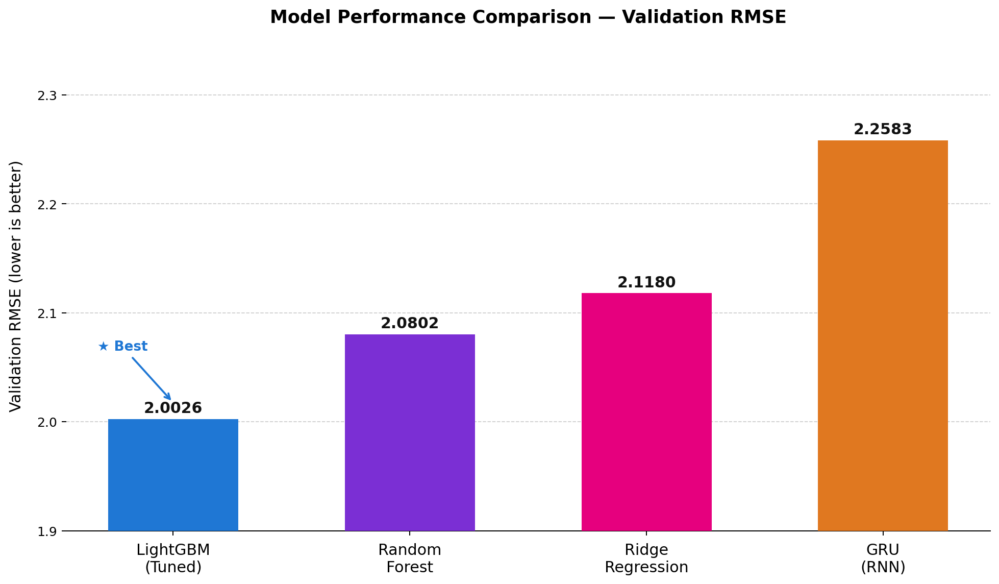
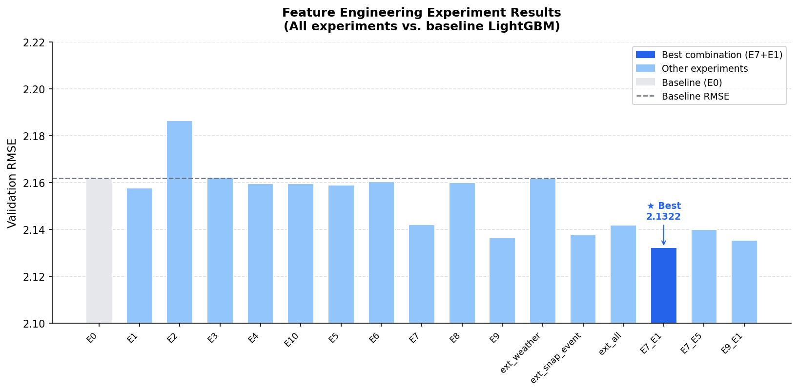
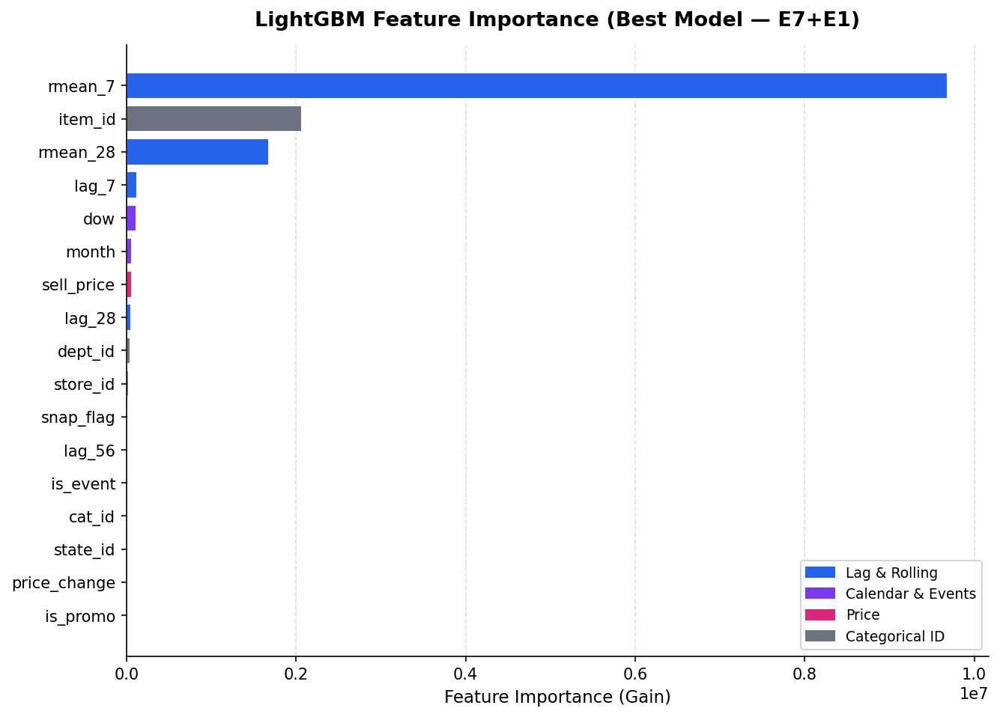
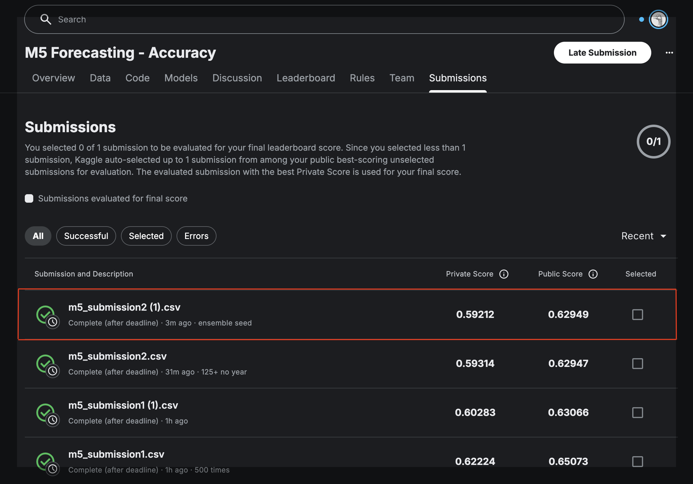

# M5 Sales Forecasting — Retail Demand Prediction at Scale

## Executive Summary

This project is based on the [Kaggle M5 Forecasting Accuracy Competition](https://www.kaggle.com/competitions/m5-forecasting-accuracy), which focuses on forecasting daily unit sales for 3,049 Walmart products across 10 stores in three US states (California, Texas, Wisconsin) over a 28-day horizon.

The pipeline spans data cleaning, systematic feature engineering experimentation, multi-model comparison, and hyperparameter optimization, ending in a Kaggle submission scored against a held-out evaluation set.

**Best result:** The best Kaggle submission, a 3-seed LightGBM ensemble using Optuna-tuned hyperparameters, achieved a private leaderboard WRMSSE of **0.59212**. The underlying tuned LightGBM model achieved a validation RMSE of **2.0026**.


---

## Business Problem

Accurate retail demand forecasting directly enables:

- **Inventory planning** — avoid stockouts on high-velocity items and reduce overstock on slow movers
- **Promotional response modeling** — quantify demand lift from SNAP benefit days and calendar events
- **Store-level resource allocation** — align replenishment schedules to actual expected sales patterns

This project simulates the core analytical workflow a demand forecasting team would execute: starting from raw historical sales data, engineering predictive features, selecting and tuning a model, and producing a competition-style 28-day forecast.

---

## Dataset

**Source:** [Kaggle M5 Forecasting — Accuracy](https://www.kaggle.com/competitions/m5-forecasting-accuracy)

| File | Description | Size |
|---|---|---|
| `sales_train_evaluation.csv` | Daily unit sales in wide format — 3,049 items × 1,941 days | ~120 MB |
| `sell_prices.csv` | Weekly item sell price per store | ~200 MB |
| `calendar.csv` | Date metadata — day-of-week, SNAP flags, event names | ~100 KB |

The raw data is not included in this repository due to file size. See [`data/README.md`](data/README.md) for download instructions.

Key data facts after cleaning:
- **30,490 time series** (3,049 items × 10 stores), 1,941 days of history
- After melting to long format and filtering to active-sale rows: millions of daily sales observations after transformation to long format
- Memory reduced by ~440 MB via downcasting before the melt step

---

## Repository Structure

```
m5-sales-forecasting-portfolio/
│
├── notebooks/
│   ├── 01_data_preparation.ipynb                 ← Parse, downcast, melt wide→long, merge tables
│   ├── 02_external_data_and_features.ipynb       ← Weather/external data exploration (see note below)
│   ├── 03_feature_engineering_experiments.ipynb  ← Systematic FE experiments (E0–E10, combinations)
│   ├── 04a_model_exploration_rf_ridge.ipynb      ← Random Forest & Ridge Regression comparison
│   ├── 04b_model_exploration_gru.ipynb           ← GRU (RNN) model
│   ├── 04c_lgbm_hyperparameter_tuning.ipynb      ← 2-phase grid search + Optuna tuning
│   └── 05_final_forecast_submission.ipynb        ← 3-seed ensemble, recursive 28-day forecast → submission CSV
│
├── results/
│   ├── model_performance_summary.csv             ← All models with RMSE, MAE
│   ├── experiment_results_summary.csv            ← All FE experiments vs. baseline
│   ├── feature_engineering_table.csv             ← Feature descriptions and leakage-safety notes
│   ├── final_model_feature_importance.csv        ← LightGBM gain-based importance (final model)
│   ├── best_lgbm_params.json                     ← Optuna best hyperparameters (trial 37)
│   ├── kaggle_best_score.png                     ← Screenshot of Kaggle leaderboard submission
│   └── images/
│       ├── model_comparison.png
│       ├── feature_importance.png
│       └── fe_experiments.png
│
├── docs/
│   ├── presentation.pdf                          ← Team slide deck
│   └── project_report.pdf                        ← Full write-up with methodology tables & figures
│
├── data/
│   └── README.md                                 ← Kaggle download instructions & expected layout
│
├── requirements.txt
└── .gitignore
```

---

## Methodology

### 1. Data Preparation (`01`, `02`)

- **Type parsing & downcasting** — reduces memory footprint by ~440 MB before the melt step
- **Leading-zero detection** — items not yet on shelf are flagged as inactive to avoid leaking zero demand into training
- **Wide → long melt** — converts 1,941 daily columns into a single `demand` column; merges `calendar` and `sell_prices`
- **External data exploration** (notebook `02`) — weather observations (max/min temperature, z-scores) and additional SNAP/event indicators were explored. Weather features produced no meaningful RMSE improvement (< 0.0001 vs. baseline) and are **not part of the final model**. The code is retained for reproducibility.

### 2. Feature Engineering (`03`)

Starting from a **14-feature baseline (E0)**, we ran 16 controlled experiments (E0–E10 plus named combinations) to measure the incremental RMSE impact of each feature group.

**Baseline features (E0) — 14 total:**

| Group | Features |
|---|---|
| Categorical | `item_id`, `dept_id`, `cat_id`, `store_id`, `state_id` |
| Calendar | `dow`, `month` |
| Price | `sell_price`, `price_change`, `is_promo` |
| Lag & Rolling | `lag_7`, `lag_28`, `rmean_7`, `rmean_28` |

**Best additions (selected after experimentation):**

| Feature | RMSE (standalone) | RMSE improvement vs. E0 |
|---|---|---|
| `snap_flag` + `is_event` (E7) | 2.1421 | −0.0198 |
| `lag_56` (E1) | 2.1578 | −0.0041 |
| **E7 + E1 combined ★** | **2.1322** | **−0.0297 (−1.4%)** |

Key leakage-safety principle: all lag/rolling features use a minimum shift equal to or beyond the 28-day forecast horizon. `lag_56` is the shortest safe additional lag.



**Features tested but not selected:**
- `lag_365` — too many NaNs at the start of series (RMSE worsened to 2.1864)
- Price enhancement features (`price_vs_mean`, `price_vs_dept_avg`) — marginal gain, added noise
- Weather features — no meaningful improvement over baseline (RMSE delta < 0.0001)

### 3. Model Exploration (`04a`, `04b`, `04c`)

RF, Ridge, and GRU models were trained on the 17-feature E7+E1 feature set. The final LightGBM model includes `is_active` as an additional indicator, bringing its total to 18 features.

| Model | RMSE | MAE | Notes |
|---|---|---|---|
| **LightGBM (Tuned)** | **2.0025** | **1.011** | Optuna trial 37; 18 features; 152 iterations |
| Random Forest | 2.0802 | 1.032 | n_estimators=300, max_depth=20; 17 features |
| Ridge Regression | 2.1180 | 1.051 | alpha=0.5; fastest to train (0.13s); 17 features |
| GRU (RNN) | 2.2584 | 1.149 | seq_len=28, units=32; stopped early at epoch 3 |

### 4. LightGBM Hyperparameter Tuning (`04c`)

A two-phase search strategy was used:

- **Phase 1 — Grid search** (12 configurations): identifies which parameter directions help. Best: `set_06_tweedie_low` (RMSE 2.0065), which lowered `tweedie_variance_power` from 1.5 → 1.2
- **Phase 2 — Focused Optuna search** (40 trials): zooms into the Phase 1 winner region. Best: trial 37 (RMSE **2.0025**)

```json
{
  "objective": "tweedie",
  "boosting_type": "gbdt",
  "learning_rate": 0.0419,
  "num_leaves": 91,
  "min_data_in_leaf": 85,
  "tweedie_variance_power": 1.277,
  "lambda_l1": 0.868,
  "lambda_l2": 0.360,
  "feature_fraction": 0.699,
  "bagging_fraction": 0.869,
  "best_iteration": 152
}
```

Full parameters: [`results/best_lgbm_params.json`](results/best_lgbm_params.json)

### 5. Final 28-Day Recursive Forecast (`05`)

The final submission uses **recursive forecasting** with a **3-seed LightGBM ensemble** (seeds 42, 123, 2024 — same hyperparameters, predictions averaged). Each of the 28 days is predicted in order, with predicted values appended to the history so they can serve as lag/rolling inputs for subsequent days. This mirrors real-world deployment where future demand is unknown.

- Forecast period: days 1942–1969 (the Kaggle evaluation window)
- Total predictions: 853,720 (30,490 series × 28 days)
- Submission format: 60,980 rows (30,490 validation + 30,490 evaluation IDs × 28 columns F1–F28)

---

## Results

### Feature Importance (Final Model)



The top three features by information gain are all time-series history signals: 7-day rolling mean (`rmean_7`), item identity (`item_id`), and 28-day rolling mean (`rmean_28`). This confirms that recent demand momentum dominates over external signals.

### Kaggle Leaderboard



| Metric | Score |
|---|---|
| **Private score** | **0.59212** |
| Public score | 0.62949 |

The evaluation metric is **WRMSSE** (Weighted Root Mean Squared Scaled Error), which accounts for sales volume and price weighting across all 42,840 time series in the M5 hierarchy. The submitted result was from the 3-seed ensemble described in notebook `05`.

---

## How to Run

### Environment Setup

```bash
pip install -r requirements.txt
```

### Local Execution

Each notebook has a **configuration cell near the top** where you set the data path for your environment. The default convention used throughout is:

```python
from pathlib import Path

DATA_DIR   = Path("../data/raw")       # Kaggle raw CSVs
OUTPUT_DIR  = Path("./cleaned_data")   # output of notebook 01
DATA_PATH  = Path("../results/long_df_with_features.parquet")  # output of notebook 03
```

Update these variables to match your local directory layout before running.

> **Google Colab users:** Uncomment the `drive.mount` cell at the top of each notebook and update the path variables to your Google Drive locations.

### Recommended Execution Order

```
01 → 02 (optional, weather experiment only) → 03 → 04c → 05
```

Notebooks `04a` and `04b` (RF/Ridge and GRU) can be run independently after notebook `03` and are not required to reproduce the final submission.

---

## Project Highlights

- **Systematic feature ablation** — 16 controlled experiments with a consistent train/validation split, each reporting RMSE, rather than ad-hoc feature addition
- **Leakage-safe feature design** — all lag and rolling features explicitly account for the 28-day forecast horizon, with documented shift values
- **Two-phase hyperparameter search** — grid search for direction, Optuna for precision, with full logging of all 40+ trials
- **Seed ensemble** — final submission averages predictions across 3 random seeds to reduce variance, a common competition technique
- **Recursive forecasting implementation** — correctly handles the M5 evaluation setup where future demand is unknown at inference time
- **Multi-model comparison** — four model families (tree ensemble, linear, RNN, gradient boosting) evaluated on consistent data splits


---

## Acknowledgments

- [Kaggle M5 Forecasting — Accuracy competition](https://www.kaggle.com/competitions/m5-forecasting-accuracy) for the dataset and evaluation framework
- [LightGBM](https://lightgbm.readthedocs.io), [Optuna](https://optuna.org), [TensorFlow/Keras](https://www.tensorflow.org), and [scikit-learn](https://scikit-learn.org) teams for open-source tooling
